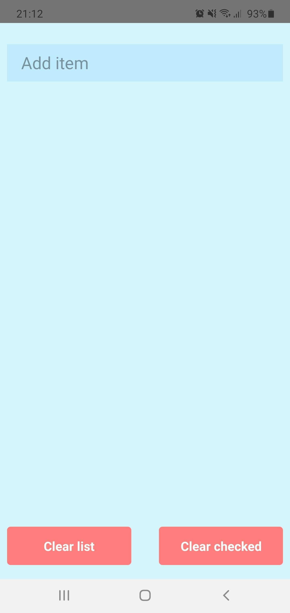
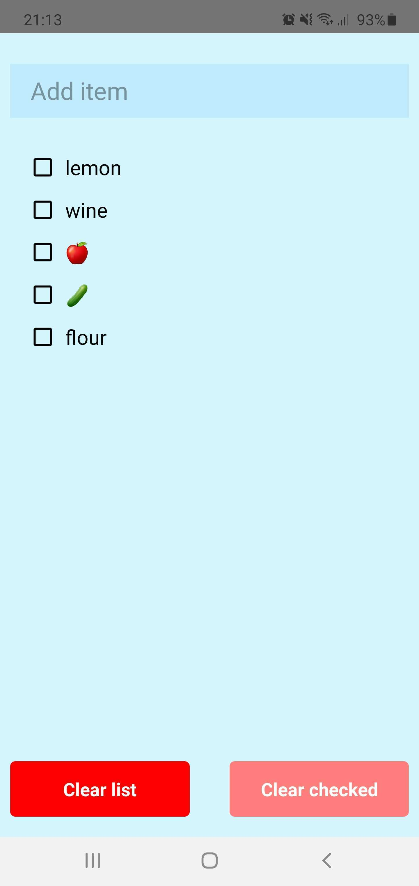
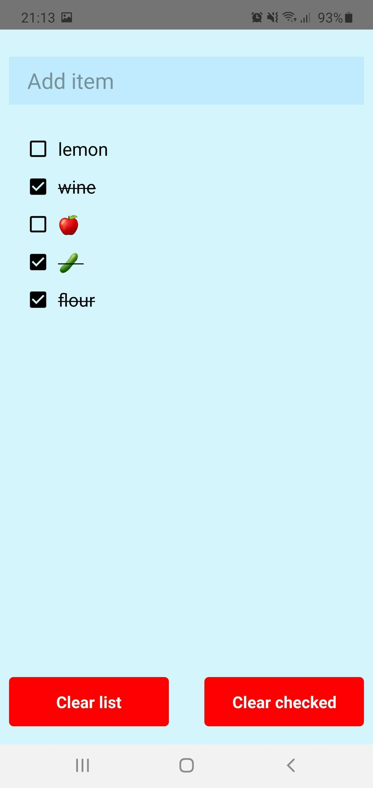
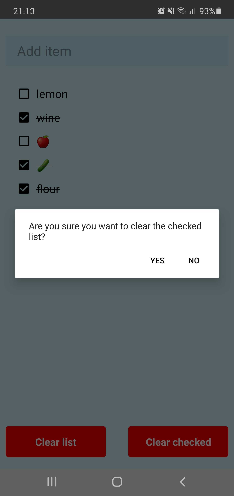
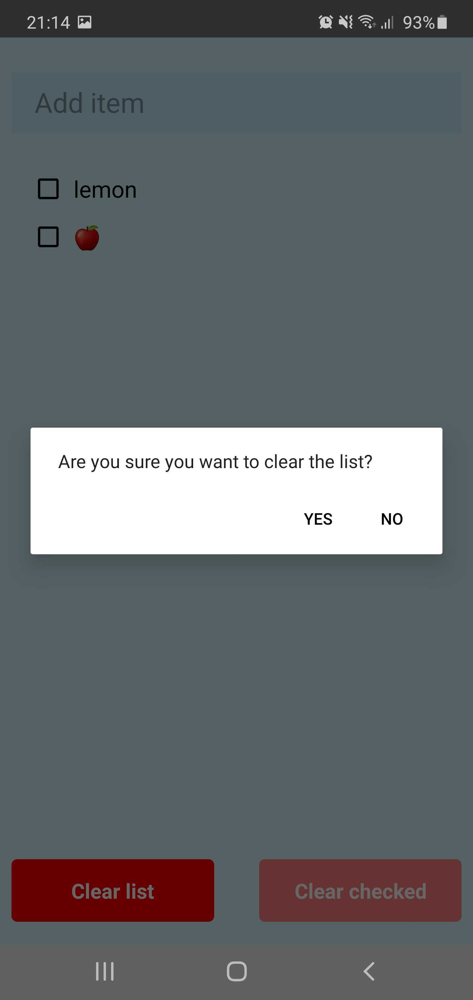

# Shopping List ReactNative
Simple shoppingList application for mobile

## Intro

Shopping List is an application that helps you to organize your shopping list.
As a user you can add items to your list
And check them once you bought them.
You can also delete the checked items or even the entire list.

<div style="display:flex;">





</div>
<div style="display:flex;">



</div>

## Version 2 of this app offers:
* edit each item
* delete each item

## How to build the app on your computer:
### On android - if you connect your phone:

* Clone this project
* cd shopping-list-reactNative
* run `npm install`
* run `npm start`
* connect an android device (make sure the device has developer mode active)
* run `npm run android`

## when using Android studio
*  you need java version < 16
*  SDK Manager is located at Android Studio->Preferences->Appearance&Behavior->System Settings->Android SDK(if you need it to install your version of android)
* make sure you have your [environment setup](https://reactnative.dev/docs/environment-setup)

## How to release app:
### On android: 

* cd `android/app`
* generate keystore (replace `your_key_name` and `your_key_alias` with the one you want): 
  ```
  keytool -genkey -v -keystore your_key_name.keystore -alias your_key_alias -keyalg RSA -keysize 2048 -validity 10000
  ```
  
 * inside `android\app\build.gradle` add your new key:
 ```
   signingConfigs {
    release {
      storeFile file('your_key_name.keystore')
      storePassword 'your_key_store_password'
      keyAlias 'your_key_alias'
      keyPassword 'your_key_file_alias_password'
    }
  }
 ```
 * then `cd android` or if you are in `android/app` run `cd ..`
 * on Linux/Mac run `./gradlew assembleRelease`
 * on Windows run : `gradlew assembleRelease`
 * your apk can be found in: `android/app/build/outputs/apk/app-release.apk`
